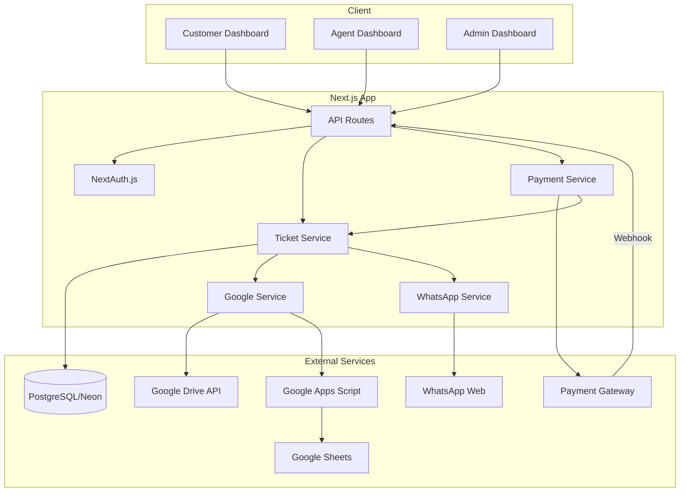

# Design Document: Haisa WA

## Overview

Haisa WA adalah sistem pengaduan WhatsApp berbasis web yang dibangun dengan Next.js 14 (App Router). Sistem ini mengintegrasikan:
- **PostgreSQL (Neon)** sebagai database utama
- **Google OAuth** untuk autentikasi
- **Payment Gateway** untuk pembayaran tiket
- **Google Drive API** untuk penyimpanan screenshot
- **Google Apps Script** untuk sinkronisasi ke Google Sheets
- **wwebjs** untuk notifikasi WhatsApp ke tim

## Architecture



## Components and Interfaces

### 1. Authentication Module

```typescript
// src/core/auth/auth.config.ts
interface AuthConfig {
  providers: ['google'];
  callbacks: {
    signIn: (user: GoogleUser) => Promise<boolean>;
    session: (session: Session, token: JWT) => Promise<Session>;
  };
}

interface User {
  id: string;
  email: string;
  name: string;
  role: 'CUSTOMER' | 'AGENT' | 'ADMIN';
  createdAt: Date;
}
```

### 2. Ticket Service

```typescript
// src/core/tickets/ticket.service.ts
interface TicketService {
  createDraft(data: CreateTicketInput): Promise<Ticket>;
  getById(id: string, userId: string): Promise<Ticket | null>;
  getByCustomer(customerId: string): Promise<Ticket[]>;
  getForAgent(agentId: string): Promise<Ticket[]>;
  getAll(): Promise<Ticket[]>;
  updateStatus(id: string, status: TicketStatus, actorId: string): Promise<Ticket>;
  assignAgent(id: string, agentId: string, actorId: string): Promise<Ticket>;
  addAttachment(ticketId: string, file: File): Promise<Attachment>;
}

interface CreateTicketInput {
  customerId: string;
  whatsAppNumber: string;
  countryRegion: string;
  issueType: IssueType;
  incidentAt: Date;
  device: string;
  waVersion: string;
  description: string;
}

type TicketStatus = 
  | 'DRAFT' 
  | 'RECEIVED' 
  | 'IN_REVIEW' 
  | 'NEED_MORE_INFO' 
  | 'IN_PROGRESS' 
  | 'RESOLVED' 
  | 'CLOSED' 
  | 'REJECTED';

type PaymentStatus = 
  | 'PENDING' 
  | 'PAID' 
  | 'FAILED' 
  | 'EXPIRED' 
  | 'REFUNDED';
```

### 3. Payment Service

```typescript
// src/core/payment/payment.service.ts
interface PaymentService {
  createOrder(ticketId: string, amount: number): Promise<PaymentOrder>;
  handleWebhook(payload: WebhookPayload): Promise<void>;
  getPaymentByTicket(ticketId: string): Promise<Payment | null>;
}

interface PaymentOrder {
  orderId: string;
  paymentUrl: string;
  amount: number;
  currency: string;
  expiresAt: Date;
}

interface WebhookPayload {
  orderId: string;
  status: 'success' | 'failed' | 'expired';
  rawPayload: Record<string, unknown>;
}
```

### 4. Google Service

```typescript
// src/core/google/google.types.ts
interface GoogleSyncResult {
  folderId: string;
  folderUrl: string;
  rowIndex: number;
}

// src/core/google/appsScript.client.ts
interface AppsScriptClient {
  ticketCreated(data: TicketCreatedPayload): Promise<GoogleSyncResult>;
  ticketUpdated(data: TicketUpdatedPayload): Promise<void>;
  attachUploaded(data: AttachUploadedPayload): Promise<void>;
}

// src/core/google/drive.client.ts
interface DriveClient {
  uploadFile(folderId: string, file: Buffer, fileName: string, mimeType: string): Promise<DriveFile>;
  deleteFile(fileId: string): Promise<void>;
}

interface DriveFile {
  id: string;
  url: string;
  name: string;
}
```

### 5. WhatsApp Service

```typescript
// src/core/whatsapp/whatsapp.service.ts
interface WhatsAppService {
  initialize(): Promise<void>;
  sendTicketNotification(ticket: Ticket): Promise<void>;
  sendStatusUpdate(ticket: Ticket, oldStatus: TicketStatus): Promise<void>;
}

interface WhatsAppConfig {
  teamNumber: string;
  sessionPath: string;
  maxRetries: number;
}
```

### 6. Audit Service

```typescript
// src/core/audit/audit.service.ts
interface AuditService {
  log(entry: AuditEntry): Promise<void>;
  getByTicket(ticketId: string): Promise<AuditLog[]>;
}

interface AuditEntry {
  actorId: string;
  ticketId: string;
  action: AuditAction;
  before: Record<string, unknown> | null;
  after: Record<string, unknown>;
}

type AuditAction = 
  | 'TICKET_CREATED'
  | 'STATUS_CHANGED'
  | 'AGENT_ASSIGNED'
  | 'ATTACHMENT_ADDED'
  | 'NOTE_ADDED';
```

## Data Models

### Database Schema (Prisma)

```prisma
// prisma/schema.prisma

generator client {
  provider = "prisma-client-js"
}

datasource db {
  provider = "postgresql"
  url      = env("DATABASE_URL")
}

enum UserRole {
  CUSTOMER
  AGENT
  ADMIN
}

enum TicketStatus {
  DRAFT
  RECEIVED
  IN_REVIEW
  NEED_MORE_INFO
  IN_PROGRESS
  RESOLVED
  CLOSED
  REJECTED
}

enum PaymentStatus {
  PENDING
  PAID
  FAILED
  EXPIRED
  REFUNDED
}

enum IssueType {
  ACCOUNT_BANNED
  ACCOUNT_SUSPENDED
  VERIFICATION_ISSUE
  HACKED_ACCOUNT
  OTHER
}

model User {
  id            String    @id @default(uuid())
  email         String    @unique
  name          String
  role          UserRole  @default(CUSTOMER)
  createdAt     DateTime  @default(now())
  updatedAt     DateTime  @updatedAt

  tickets       Ticket[]  @relation("CustomerTickets")
  assignedTickets Ticket[] @relation("AgentTickets")
  attachments   Attachment[]
  auditLogs     AuditLog[]
}

model Ticket {
  id                    String        @id @default(uuid())
  ticketNo              String        @unique
  customerId            String
  customer              User          @relation("CustomerTickets", fields: [customerId], references: [id])
  
  status                TicketStatus  @default(DRAFT)
  paymentStatus         PaymentStatus @default(PENDING)
  
  assignedAgentId       String?
  assignedAgent         User?         @relation("AgentTickets", fields: [assignedAgentId], references: [id])
  
  whatsAppNumber        String
  countryRegion         String
  issueType             IssueType
  incidentAt            DateTime
  device                String
  waVersion             String
  description           String
  notesInternal         String?
  
  googleDriveFolderId   String?
  googleDriveFolderUrl  String?
  googleSheetRowIndex   Int?
  
  createdAt             DateTime      @default(now())
  updatedAt             DateTime      @updatedAt
  closedAt              DateTime?

  attachments           Attachment[]
  payments              Payment[]
  auditLogs             AuditLog[]
}

model Attachment {
  id            String    @id @default(uuid())
  ticketId      String
  ticket        Ticket    @relation(fields: [ticketId], references: [id])
  uploaderId    String
  uploader      User      @relation(fields: [uploaderId], references: [id])
  
  fileName      String
  mimeType      String
  size          Int
  
  driveFileId   String?
  driveFileUrl  String?
  
  createdAt     DateTime  @default(now())
}

model Payment {
  id            String        @id @default(uuid())
  ticketId      String
  ticket        Ticket        @relation(fields: [ticketId], references: [id])
  
  provider      String
  orderId       String        @unique
  amount        Int
  currency      String        @default("IDR")
  status        PaymentStatus @default(PENDING)
  rawPayload    Json?
  
  createdAt     DateTime      @default(now())
  updatedAt     DateTime      @updatedAt
}

model AuditLog {
  id            String    @id @default(uuid())
  actorId       String
  actor         User      @relation(fields: [actorId], references: [id])
  ticketId      String
  ticket        Ticket    @relation(fields: [ticketId], references: [id])
  
  action        String
  before        Json?
  after         Json
  
  createdAt     DateTime  @default(now())
}
```

### TicketNo Generation

```typescript
// Format: WAC-YYYY-NNNNNN
// Example: WAC-2025-000123

function generateTicketNo(sequence: number): string {
  const year = new Date().getFullYear();
  const paddedSeq = sequence.toString().padStart(6, '0');
  return `WAC-${year}-${paddedSeq}`;
}
```


## Correctness Properties

*A property is a characteristic or behavior that should hold true across all valid executions of a system-essentially, a formal statement about what the system should do. Properties serve as the bridge between human-readable specifications and machine-verifiable correctness guarantees.*

### Property 1: User Authentication Idempotence
*For any* valid Google user data, authenticating multiple times SHALL either create a new user (first time) or retrieve the existing user, and the result SHALL be the same user record.
**Validates: Requirements 1.2**

### Property 2: Ticket Creation Initial State
*For any* valid ticket form data, creating a ticket SHALL result in a ticket with status DRAFT and paymentStatus PENDING.
**Validates: Requirements 2.1**

### Property 3: TicketNo Format and Uniqueness
*For any* created ticket, the ticketNo SHALL match the pattern `WAC-\d{4}-\d{6}` and SHALL be unique across all tickets.
**Validates: Requirements 2.2**

### Property 4: Ticket-Payment Association
*For any* created ticket draft, there SHALL exist exactly one associated Payment record with status PENDING.
**Validates: Requirements 2.3**

### Property 5: WhatsApp Number Validation
*For any* string that does not match a valid international phone number format, ticket creation SHALL be rejected.
**Validates: Requirements 2.4**

### Property 6: Sensitive Keyword Blocking
*For any* ticket description containing blocked keywords (OTP, password, PIN, verification code), ticket creation SHALL be rejected.
**Validates: Requirements 2.5**

### Property 7: Required Fields Validation
*For any* ticket submission missing any required field (whatsAppNumber, countryRegion, issueType, incidentAt, device, waVersion, description), the submission SHALL be rejected.
**Validates: Requirements 2.6**

### Property 8: File Type Validation
*For any* file upload with MIME type not in the allowlist (image/png, image/jpeg, image/webp), the upload SHALL be rejected.
**Validates: Requirements 3.1**

### Property 9: Drive Upload Persistence
*For any* successful file upload to Google Drive, the corresponding Attachment record SHALL have non-null driveFileId and driveFileUrl.
**Validates: Requirements 3.5**

### Property 10: Payment Webhook State Machine
*For any* payment webhook:
- If status is 'success', paymentStatus SHALL become PAID and ticket status SHALL become RECEIVED
- If status is 'failed', paymentStatus SHALL become FAILED and ticket status SHALL remain DRAFT
- If status is 'expired', paymentStatus SHALL become EXPIRED
**Validates: Requirements 4.2, 4.3, 4.4**

### Property 11: Draft Ticket Auto-Cancellation
*For any* ticket with status DRAFT and createdAt older than 24 hours, the ticket SHALL be marked as cancelled (status DRAFT, paymentStatus EXPIRED).
**Validates: Requirements 4.6**

### Property 12: Drive Folder Path Structure
*For any* ticket with Google Drive folder, the folder path SHALL follow the structure `ROOT_FOLDER/YYYY-MM/TicketNo/` where YYYY-MM matches the ticket's creation month.
**Validates: Requirements 5.1**

### Property 13: Drive Folder Record Persistence
*For any* ticket where Google Sync has completed, the ticket record SHALL have non-null googleDriveFolderId and googleDriveFolderUrl.
**Validates: Requirements 5.3**

### Property 14: Sheets Row Index Persistence
*For any* ticket that has been synced to Google Sheets, the ticket record SHALL have a non-null googleSheetRowIndex.
**Validates: Requirements 6.2**

### Property 15: Sheets Sync Payload Completeness
*For any* ticket sync payload sent to Apps Script, the payload SHALL contain all required fields: TicketNo, CreatedAt, CustomerName, CustomerEmail, WhatsAppNumber, CountryRegion, IssueType, IncidentAt, Device, WhatsAppVersion, Status, PaymentStatus, AssignedAgent, DriveFolderUrl, NotesInternal, LastUpdatedAt.
**Validates: Requirements 6.4**

### Property 16: Apps Script Secret Validation
*For any* request to Apps Script endpoint without valid X-SYNC-SECRET header, the request SHALL be rejected with 401 status.
**Validates: Requirements 6.5**

### Property 17: RBAC Access Control
*For any* user and ticket combination:
- If user.role is CUSTOMER, user SHALL only access tickets where ticket.customerId equals user.id
- If user.role is AGENT, user SHALL only access tickets where ticket.assignedAgentId equals user.id OR ticket is unassigned
- If user.role is ADMIN, user SHALL access all tickets
**Validates: Requirements 7.1, 8.1, 9.1, 9.4**

### Property 18: Ticket List Response Fields
*For any* ticket list API response, each ticket object SHALL contain: ticketNo, status, paymentStatus, createdAt, and issueType.
**Validates: Requirements 7.2**

### Property 19: Audit Log Completeness
*For any* ticket modification (status change, assignment change, note addition), an AuditLog entry SHALL be created with: actorId, ticketId, action, before state (JSON), after state (JSON), and createdAt timestamp.
**Validates: Requirements 11.1, 11.2, 11.3**

### Property 20: Audit Log Immutability
*For any* AuditLog entry once created, the entry SHALL never be deleted or modified.
**Validates: Requirements 11.4**

### Property 21: Rate Limiting
*For any* customer who has submitted more than N tickets within a time window T, subsequent submissions SHALL be rejected until the window expires.
**Validates: Requirements 12.1**

### Property 22: API Authentication
*For any* request to protected API endpoints without valid session/token, the response SHALL be 401 Unauthorized.
**Validates: Requirements 12.3**

### Property 23: UUID Generation
*For any* created ticket, the id field SHALL be a valid UUID v4.
**Validates: Requirements 13.2**

### Property 24: Webhook Payload Preservation
*For any* payment webhook received, the rawPayload field in Payment record SHALL contain the complete original webhook JSON.
**Validates: Requirements 13.3**

### Property 25: Ticket Serialization Round-Trip
*For any* valid Ticket object, serializing to JSON and deserializing back SHALL produce an equivalent Ticket object.
**Validates: Requirements 13.5, 13.6**

### Property 26: WhatsApp Notification Content
*For any* WhatsApp notification sent for a ticket, the message SHALL contain: ticketNo, customer name, issue type, and dashboard link.
**Validates: Requirements 10.2**

### Property 27: Notification Retry Behavior
*For any* failed WhatsApp notification attempt, the system SHALL retry up to 3 times before marking as failed.
**Validates: Requirements 10.3**

## Error Handling

### Input Validation Errors
| Error Code | Condition | Response |
|------------|-----------|----------|
| INVALID_WA_NUMBER | WhatsApp number format invalid | 400 Bad Request with field error |
| SENSITIVE_CONTENT | Description contains blocked keywords | 400 Bad Request with warning |
| MISSING_REQUIRED_FIELD | Required field is empty/null | 400 Bad Request with field list |
| INVALID_FILE_TYPE | File MIME type not in allowlist | 400 Bad Request with allowed types |
| FILE_TOO_LARGE | File exceeds 10MB | 400 Bad Request with size limit |
| MAX_ATTACHMENTS | Ticket already has 5 attachments | 400 Bad Request with limit info |

### Authentication/Authorization Errors
| Error Code | Condition | Response |
|------------|-----------|----------|
| UNAUTHORIZED | No valid session | 401 Unauthorized |
| FORBIDDEN | User lacks permission for resource | 403 Forbidden |
| INVALID_SYNC_SECRET | Apps Script secret mismatch | 401 Unauthorized |

### Business Logic Errors
| Error Code | Condition | Response |
|------------|-----------|----------|
| TICKET_NOT_FOUND | Ticket ID doesn't exist | 404 Not Found |
| PAYMENT_NOT_PAID | Attempting action requiring payment | 402 Payment Required |
| INVALID_STATUS_TRANSITION | Invalid ticket status change | 400 Bad Request |
| RATE_LIMIT_EXCEEDED | Too many submissions | 429 Too Many Requests |

### External Service Errors
| Error Code | Condition | Response |
|------------|-----------|----------|
| PAYMENT_GATEWAY_ERROR | Payment provider unavailable | 503 Service Unavailable |
| GOOGLE_SYNC_ERROR | Apps Script/Drive API failure | 503 Service Unavailable (with retry) |
| WHATSAPP_SEND_ERROR | WhatsApp notification failed | Log error, continue (non-blocking) |

## Testing Strategy

### Property-Based Testing Library
**Library:** fast-check (TypeScript)

Property-based tests will be used to verify universal properties that should hold across all inputs. Each property test will run a minimum of 100 iterations.

### Test Categories

#### 1. Unit Tests
Unit tests verify specific examples and edge cases:
- Ticket service CRUD operations
- Payment service order creation
- Validation functions (WA number, file type, sensitive keywords)
- TicketNo generation
- UUID validation

#### 2. Property-Based Tests
Property tests verify universal properties across random inputs:

| Property | Test File | Iterations |
|----------|-----------|------------|
| Property 2: Ticket Creation Initial State | `ticket.service.property.test.ts` | 100 |
| Property 3: TicketNo Format and Uniqueness | `ticket.service.property.test.ts` | 100 |
| Property 5: WhatsApp Number Validation | `validation.property.test.ts` | 100 |
| Property 6: Sensitive Keyword Blocking | `validation.property.test.ts` | 100 |
| Property 7: Required Fields Validation | `validation.property.test.ts` | 100 |
| Property 8: File Type Validation | `attachment.property.test.ts` | 100 |
| Property 10: Payment Webhook State Machine | `payment.service.property.test.ts` | 100 |
| Property 17: RBAC Access Control | `rbac.property.test.ts` | 100 |
| Property 19: Audit Log Completeness | `audit.service.property.test.ts` | 100 |
| Property 25: Ticket Serialization Round-Trip | `ticket.serialization.property.test.ts` | 100 |

Each property-based test MUST be tagged with:
```typescript
// **Feature: haisa-wa, Property {number}: {property_text}**
```

#### 3. Integration Tests
Integration tests verify component interactions:
- Payment webhook → Ticket status update → Google Sync flow
- File upload → Drive storage → Attachment record update
- Ticket creation → Payment order creation

### Test File Structure
```
src/
  core/
    tickets/
      __tests__/
        ticket.service.test.ts
        ticket.service.property.test.ts
        ticket.serialization.property.test.ts
    payment/
      __tests__/
        payment.service.test.ts
        payment.service.property.test.ts
    validation/
      __tests__/
        validation.test.ts
        validation.property.test.ts
    auth/
      __tests__/
        rbac.property.test.ts
    audit/
      __tests__/
        audit.service.test.ts
        audit.service.property.test.ts
    google/
      __tests__/
        drive.client.test.ts
        appsScript.client.test.ts
```

### Test Configuration
```typescript
// vitest.config.ts
export default defineConfig({
  test: {
    globals: true,
    environment: 'node',
    include: ['src/**/*.test.ts'],
    coverage: {
      provider: 'v8',
      reporter: ['text', 'json', 'html'],
    },
  },
});
```
